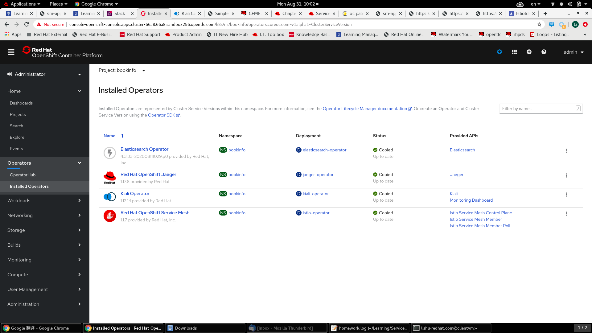

# GPTE Service Mesh Advanced - Homework  

1. Clone files from GitHub

At your work directory, run command below to download the files  
```
git clone https://github.com/lees07/service-mesh-adv-homework.git
```


2. Order Lab Env  

Order OPENTLC OpenShift 4 Labs -> OpenShift 4 Service Mesh Lab in OPENTLC Environment  
And then, login to Openshift 4 Api Server:  
```
oc login <openshift 4 api url> -u '<user>' -p '<password>'
```


3. Install PoC Demo App  

Install Bookinfo Demo App on Openshift 4  
```
oc new-project bookinfo
oc apply -f https://raw.githubusercontent.com/istio/istio/1.4.0/samples/bookinfo/platform/kube/bookinfo.yaml -n bookinfo
oc expose service productpage
```

Test Bookinfo Demo App deployed  
```
oc get pod -n bookinfo
curl -o /dev/null -s -w "%{http_code}\n" http://$(oc get route productpage -n bookinfo --template '{{ .spec.host }}')
```


4. Install Service Mesh and Control Plane  

View console url and access Openshift web console using browser  

```
echo -en "\n\nhttps://`oc get route console -o template --template {{.spec.host}} -n openshift-console`\n"
```

Install service mesh operators  


Install control plane  
```
oc adm new-project bookretail-istio-system --display-name="Bookretail Service Mesh System"
oc apply -n bookretail-istio-system -f service-mesh-control-plane.yaml
```

5. Assign bookinfo project in ServiceMeshRoll  

Inject service mesh into Bookinfo Demo App  
```
oc apply -n bookretail-istio-system -f service-mesh-roll.yaml
./bookinfo-istio-inject.sh
```

Verify service mesh injected (there are 2 containers per pod) and delete openshift route of productpage  
```
oc get pod -n bookinfo
oc delete route productpage -n bookinfo
```


6. Create service mesh control objects  

Create Policy, DestinationRule, Gateway and VirtualService  
Set mTLS mode of STRICT  
```
oc apply -n bookinfo -f bookinfo-smco-all-mtls.yaml
```


7. Test  

Use curl to access Bookinfo Demo App  
```
curl -o /dev/null -s -w "%{http_code}\n" http://$(oc get route istio-ingressgateway -n bookretail-istio-system --template '{{ .spec.host }}')/productpage
```

or open url below in browser  
```
echo -en "\nhttp://$(oc get route istio-ingressgateway -n bookretail-istio-system --template '{{ .spec.host }}')/productpage\n"
```

8. Monitoring by Kiali and Jaeger  

Access Kiali web console to monitor Bookinfo Demo App  
```
echo -en "\nhttps://$(oc get route kiali -n bookretail-istio-system --template '{{ .spec.host }}')\n"
```
